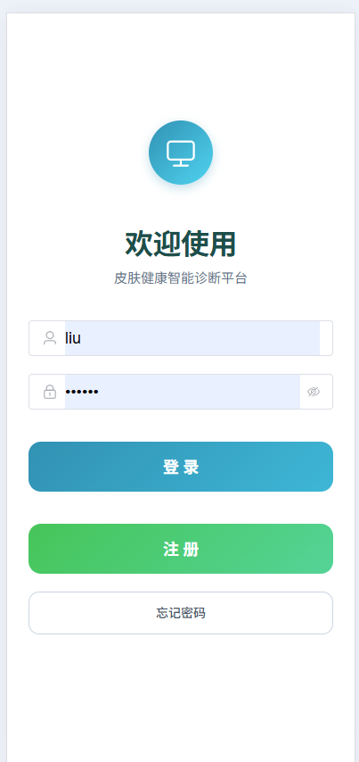
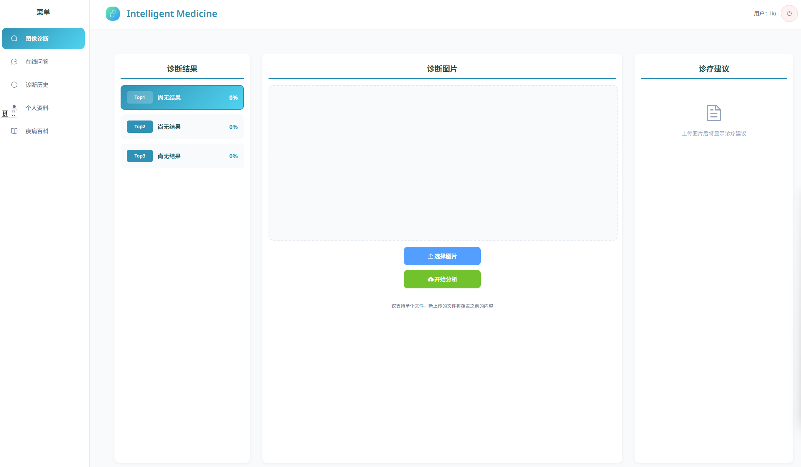
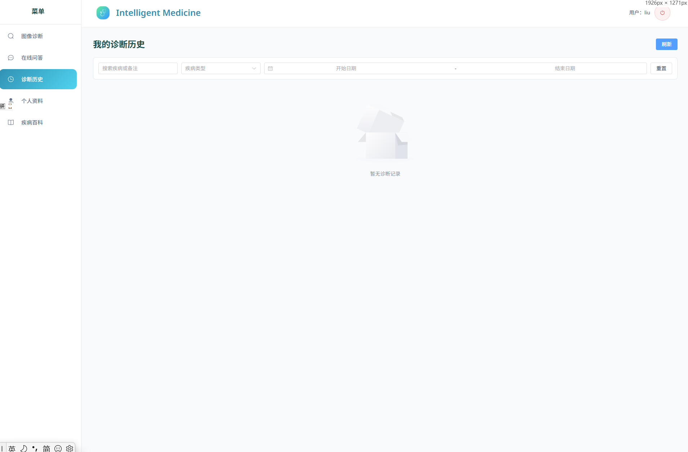
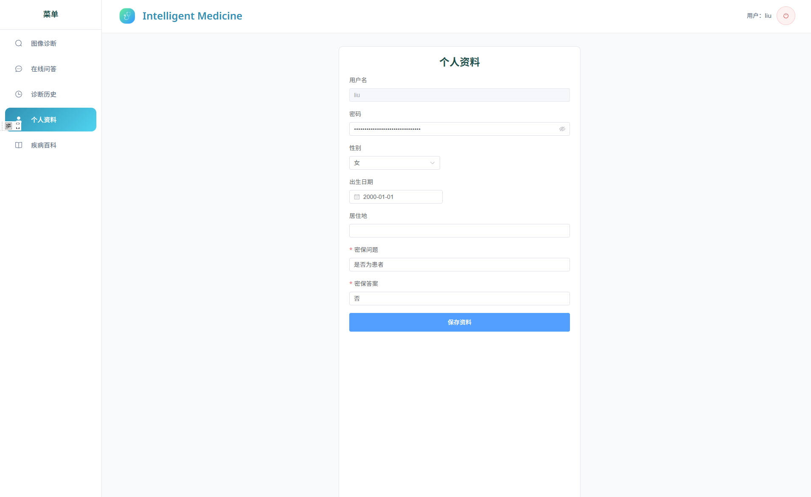
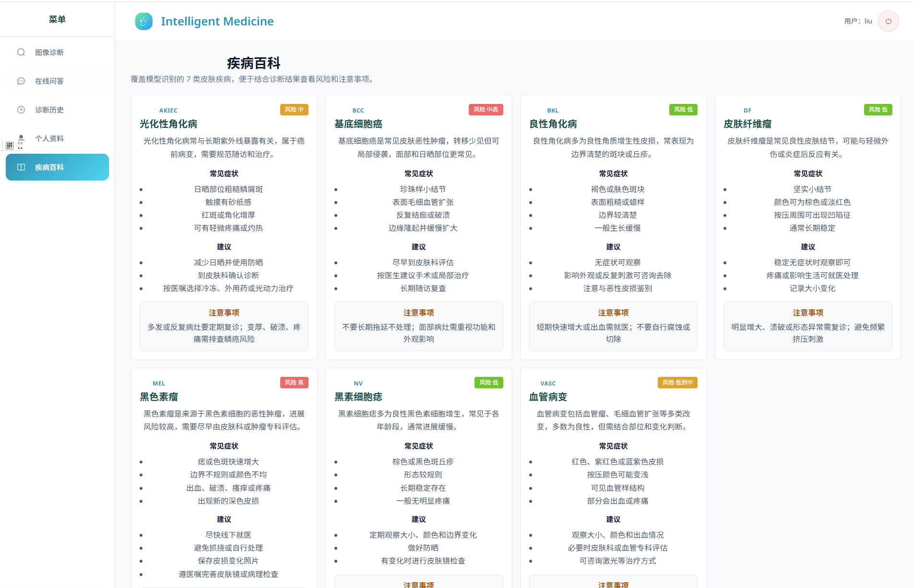
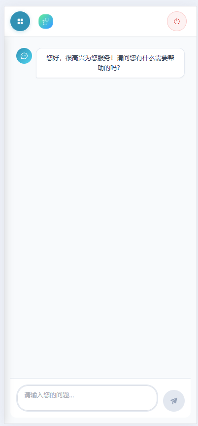
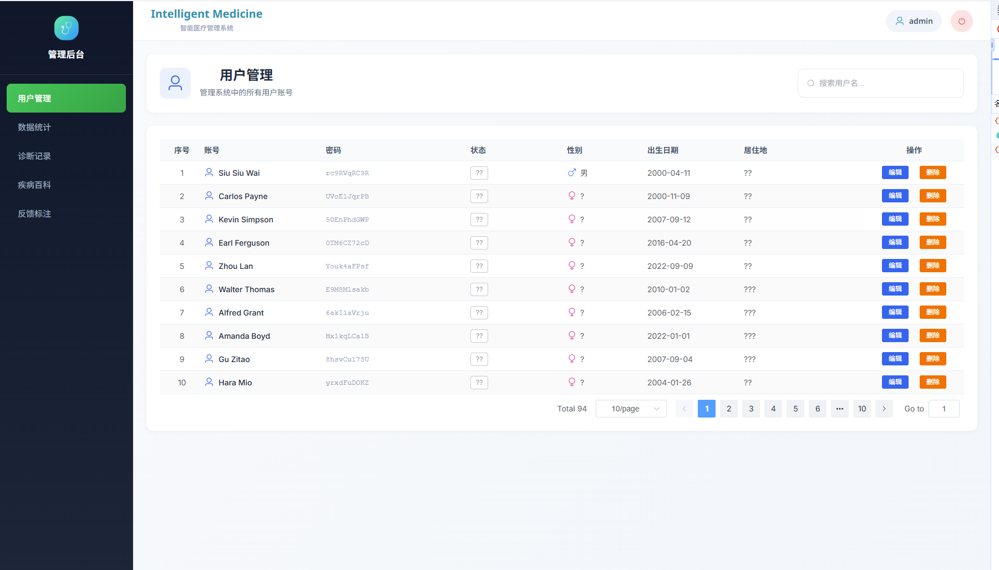
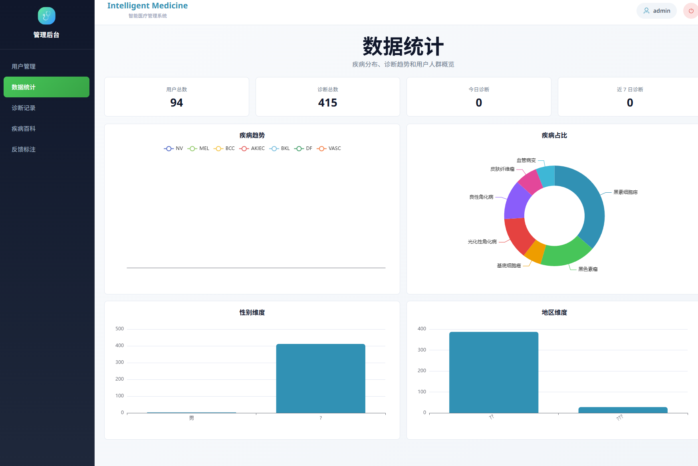
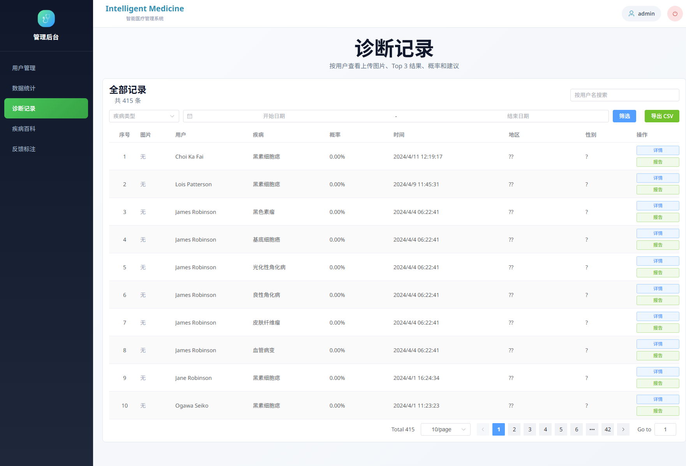
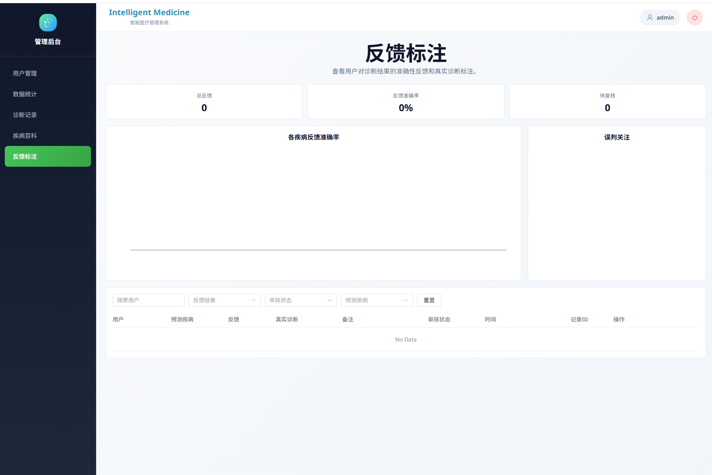

# 皮肤智诊 SkinAnalysis

皮肤智诊（SkinAnalysis）是一套基于深度学习的皮肤病辅助分析系统。当前分支采用本地分离启动方式，不再依赖 Docker 一键编排，前端、模型服务、业务后端和数据库分别运行，便于开发、调试和演示。

模型训练数据集来源：ISIC2019。受数据集范围限制，当前仅支持部分皮肤疾病的辅助识别，结果仅供健康管理参考，不能替代医生面诊、皮肤镜检查或病理诊断。

## 核心功能

- 用户端图像诊断：上传皮肤图片，查看 Top 3 识别结果、概率、疾病简介和建议。
- 风险分级与就医提醒：根据识别疾病和置信度展示低风险、中风险、高风险、低置信度等分级，并提示复查或尽快就医。
- 病灶随访：用户可建立同一处皮损的随访档案，上传诊断时关联档案，并查看时间线、首末图片和置信度变化。
- 诊断报告：诊断历史支持详情查看、筛选和报告下载，报告中包含风险分级和就医提醒。
- 在线问答：结合最近一次诊断结果和疾病知识，提供皮肤健康问答，支持聊天记录保存、推荐追问和高危症状提醒。
- 疾病百科：展示模型覆盖的疾病知识，管理端可维护内容来源、版本、编辑人和审核状态。
- 个人资料：支持用户信息维护、密码修改和安全问题。
- 管理后台：用户管理、诊断记录、数据统计、反馈审核、审核工作台、模型表现看板。
- 反馈闭环：用户可反馈识别结果是否准确，管理端可审核并统计模型表现。

## 系统架构

- 前端：Vue 3 + Vite + Element Plus + ECharts
- 模型服务：Flask + ONNX
- 数据服务：Spring Boot + Spring Data JPA
- 数据库：MySQL 8

服务端口：

| 服务 | 地址 |
| --- | --- |
| Vue 前端 | `http://localhost:8088` |
| Flask 模型服务 | `http://localhost:5001` |
| Spring Boot 数据服务 | `http://localhost:8888` |
| MySQL | `localhost:3308` |

前端开发代理：

- `/spring_api/*` -> `http://127.0.0.1:8888/*`
- `/flask_api/*` -> `http://127.0.0.1:5001/*`

## 目录说明

```text
SkinAnalysis
├── vue_app/          # Vue 前端
├── springboot_app/   # Spring Boot 数据服务
├── onnx_app/         # Flask 模型服务
├── mysql/init/       # 数据库初始化脚本
├── scripts/          # 本地启动/停止脚本
├── assets/           # README 功能截图
└── 测试图片/          # 可用于测试上传的皮肤图片
```

## 环境要求

- Node.js：建议 18.x
- JDK：17 或更高版本
- Python：建议 3.8 到 3.10
- MySQL：建议 8.x
- Maven：可直接使用项目自带的 `springboot_app/mvnw.cmd`

## 本地启动

建议打开 4 个 PowerShell 窗口，按顺序分别启动 MySQL、Spring Boot、Flask 和 Vue。

### 1. 启动项目专用 MySQL

```powershell
.\scripts\start-local-mysql.ps1
```

默认配置：

- 数据库：`SkinAnalysis`
- 地址：`127.0.0.1:3308`
- 用户名：`root`
- 密码：`root`

数据库数据保存在 `.local-run/mysql-data`，该目录已被 `.gitignore` 忽略。首次启动时会导入 `mysql/init/init.sql`，后续本机数据会继续保留。

停止 MySQL：

```powershell
.\scripts\stop-local-mysql.ps1
```

### 2. 启动 Spring Boot

```powershell
$env:JAVA_HOME="C:\Program Files\Java\jdk-22"
$env:Path="$env:JAVA_HOME\bin;$env:Path"
cd springboot_app
.\mvnw.cmd spring-boot:run
```

如果你使用 JDK 17，把 `JAVA_HOME` 改成自己的 JDK 17 安装路径即可。

### 3. 启动 Flask 模型服务

```powershell
cd onnx_app
pip install -r requirements.txt
$env:FLASK_PORT="5001"
python app.py
```

如果希望使用虚拟环境：

```powershell
cd onnx_app
python -m venv .venv
.\.venv\Scripts\Activate.ps1
pip install -r requirements.txt
$env:FLASK_PORT="5001"
python app.py
```

### 4. 启动 Vue 前端

```powershell
cd vue_app
npm install
npm run dev
```

启动完成后访问：

- 用户端：`http://localhost:8088`
- 管理端：`http://localhost:8088/admin`

管理员默认账号：

- 用户名：`admin`
- 密码：`123456`

## AI 问答配置

当前在线问答使用智谱 AI，配置文件为：

```text
vue_app/zhipu_api-key.js
```

如果问答不可用，优先检查 API Key 是否填写正确。

## 常用验证命令

前端构建：

```powershell
cd vue_app
npm run build
```

后端测试：

```powershell
cd springboot_app
$env:JAVA_HOME="C:\Program Files\Java\jdk-22"
$env:Path="$env:JAVA_HOME\bin;$env:Path"
.\mvnw.cmd test
```

## 界面预览

### 用户端

登录与注册入口：



图像诊断与模型分析：



诊断历史筛选：



病灶随访：

- 用户可新建随访档案，记录皮损部位和备注。
- 图像诊断时可将本次诊断关联到随访档案。
- 随访页面支持按时间线查看同一病灶记录，并对比首次和最近一次图片、疾病结果和置信度变化。

个人资料维护：



疾病百科：



移动端 AI 问答：



AI 问答增强：

- 自动保存用户与助手的最近聊天记录。
- 根据最近一次诊断结果提供推荐追问。
- 当用户描述快速增大、出血、破溃、疼痛、颜色异常等高危症状时，页面会显示醒目的线下就医提醒。
- 问答回复仅作为健康管理参考，不能替代医生面诊、皮肤镜或病理检查。

### 管理端

用户管理：



数据统计：



诊断记录管理：



反馈审核与模型表现：



审核工作台：

- 自动汇总高风险诊断、低置信度诊断和用户不准确反馈。
- 管理员可将任务标记为已审核、需复查或疑似误判。
- 支持将复核任务标记为可用于训练集，便于后续模型改进。

疾病百科维护：

- 管理端可编辑疾病名称、风险等级、简介、症状、建议和注意事项。
- 支持维护资料来源、版本号、编辑人和审核状态，便于演示内容可信度和维护流程。

## 更多本地说明

更详细的本地启动和故障排查说明见：

```text
README_LOCAL.md
```
